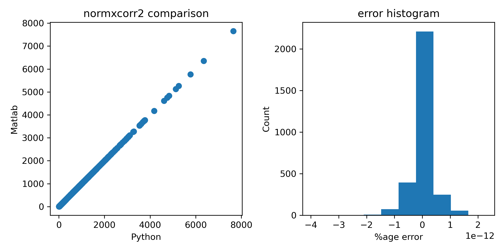

# normxcorr2sp
Matlab's normxcorr2 implementation in Python (3.10). 

## Key python script = normxcorr2sp.py
It has the normxcorr2 function. I have essentially ported Matlab's code line-by-line. 

## Verification: 
- Dataset: I have used speech cochleagrams to verify using the function create_test_dataset_nx2.m. The output images are templates 
  are in the 'images' and 'templates' folders respectively. 
- Matlab output: See create_matlab_output.m 
- Python output: See test_normxcorr2_py.py 

In this limited testing, the matlab and python outputs match very well. But there maybe other bugs (please use the issues functionality to report any bugs). 

